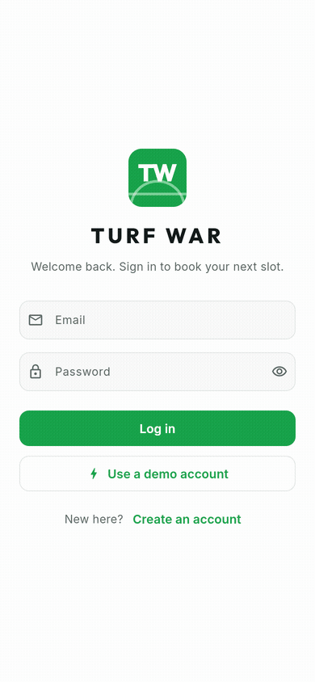
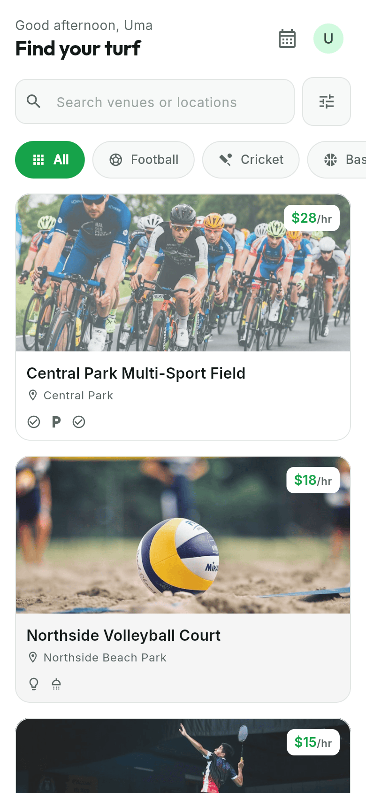
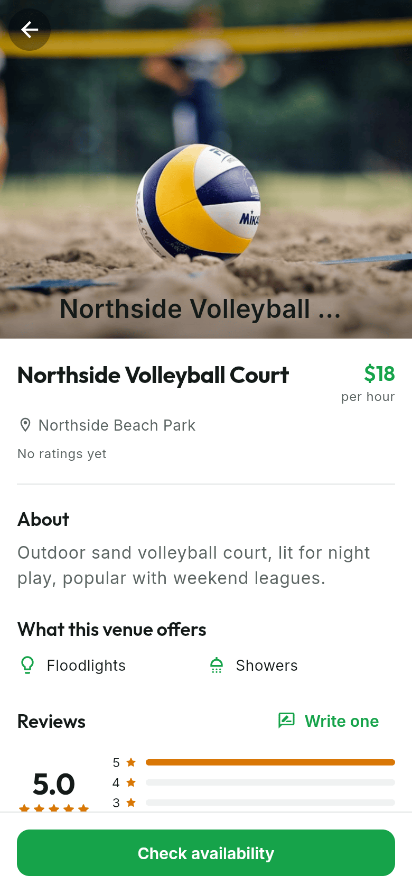
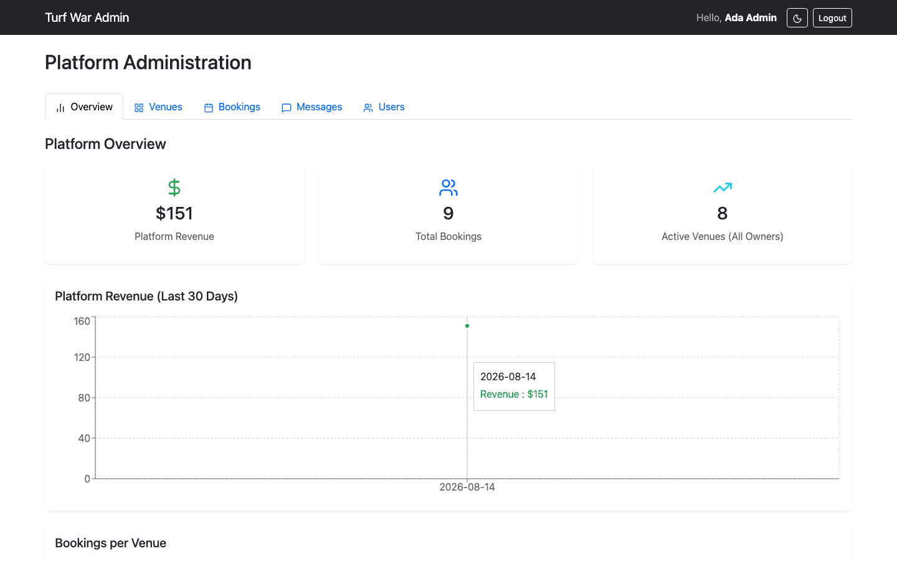
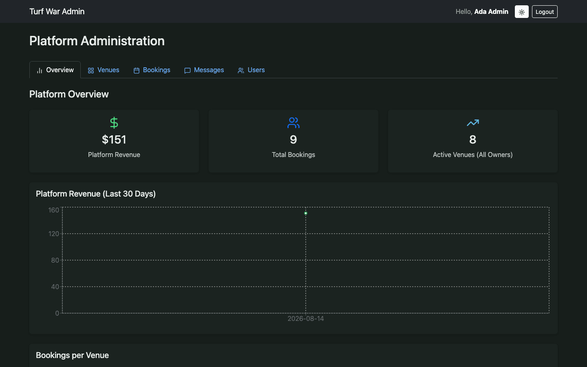
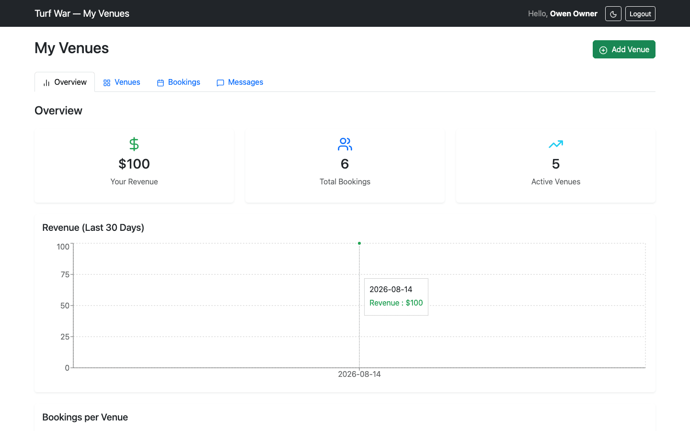
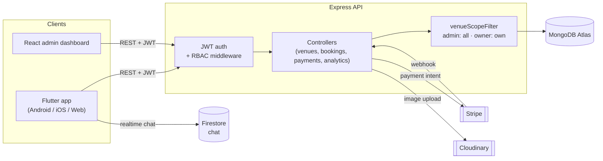

# Turf War

[](https://github.com/Junaid-Abrar/Turf_War_Platform/actions/workflows/ci.yml)
[](LICENSE)
[](backend/package.json)
[](mobile-app/pubspec.yaml)
[](web-admin/package.json)

A full-stack turf/sports-venue booking platform: a Node/Express + MongoDB API,
a Flutter mobile app (Android/iOS/Web) for players and venue owners, and a
React admin dashboard — with role-scoped data, server-side price calculation,
and Stripe payments.

## Live demo

| | |
|---|---|
| **Web admin** | https://turf-war-platform.vercel.app |
| **Mobile (web build)** | https://turf-war-platform-pfwq.vercel.app |
| **Android APK** | See [Releases](../../releases) |
| **API** | https://turf-war-platform.onrender.com (`/health`, `/api-docs`) |

> The backend is on Render's free tier, which cold-starts after 15 minutes of
> inactivity — the first request after a while can take ~50s. Everything
> after that is normal speed.

### Demo credentials

Seeded by `backend/scripts/seed.js`, all sharing one password:

| Role | Email | Password |
|---|---|---|
| Admin | `admin@turfwar.demo.com` | `password123` |
| Venue owner | `owner@turfwar.demo.com` | `password123` |
| Venue owner | `owner2@turfwar.demo.com` | `password123` |
| Player | `user@turfwar.demo.com` | `password123` |

The web-admin dashboard only supports the `admin` and `venue_owner` roles.
The `user` role is for the mobile app, which also has a **"Use a demo
account"** picker on its login screen — no typing required. There are two
seeded venue owners (5 venues / 3 venues) so you can see the admin's
platform-wide view against each owner's scoped view — log in as one, then
the other, to compare.

### About the web build of the mobile app

The Flutter app is normally a native Android/iOS app; the web build in
`web-demo/` is a build-time `DEMO_MODE` variant that stubs the Stripe payment
sheet (shows a simulated success) and skips Firebase Cloud Messaging
registration, since neither works in a browser context. A notice on the
Profile screen makes this explicit. The Android APK is the real thing —
live Stripe test-mode payments and push notifications.

## Booking flow

<p align="center">
  
</p>

## Screenshots

| Player — browse | Player — venue detail |
|---|---|
|  |  |

| Admin — platform-wide (light) | Admin — platform-wide (dark) |
|---|---|
|  |  |

| Venue owner — scoped to their venues |
|---|
|  |

## Features by role

**Player**
- Browse venues by sport, location, and price; filter and search
- Book an hourly slot with live availability and server-priced totals
- Pay by card (Stripe) or use demo mode on web
- Manage bookings (upcoming / past / cancelled) and cancel ahead of time
- Leave star ratings and reviews; in-app chat with venue owners
- Light/dark theme, persisted

**Venue owner**
- Everything a player can do, plus:
- List and edit venues (photos via Cloudinary, amenities, pricing)
- See bookings and revenue **scoped to their own venues only**
- Confirm or reject pending bookings

**Admin**
- Platform-wide analytics — revenue, bookings, and active venues **across
  every owner**, not just their own
- View and manage all venues and bookings, with an owner column so ownership
  stays visible
- User management (list all accounts and roles)

## Architecture

```
backend/      Node.js + Express + MongoDB API (JWT auth, Stripe payments,
              Cloudinary image uploads, Socket.io chat)
mobile-app/   Flutter app — players book venues, owners manage listings
web-admin/    React + Vite admin dashboard for venue owners and admins
web-demo/     Committed static build of mobile-app for web (see its README)
```



Request flow for a booking (the part worth reading closely): the client
sends a venue + time slot, never a price — the **server looks up the venue's
hourly rate and computes the total itself**, so a tampered client request
can't book at an arbitrary price. See [docs/ARCHITECTURE.md](docs/ARCHITECTURE.md)
for the full data model and request-flow diagrams.

## Tech stack

| Layer | Choice | Why |
|---|---|---|
| API | Node.js + Express 5 | Team-wide JS familiarity; Express 5's native async error propagation removed the need for a try/catch wrapper on every route |
| Database | MongoDB + Mongoose | Venue/booking documents are naturally nested (amenities, images, time ranges) — a document model avoided join-heavy schema for data that's read far more than it's relationally queried |
| Auth | JWT + bcrypt | Stateless auth keeps the API horizontally scalable without a session store; short-lived tokens checked client-side (`exp`) and server-side |
| Payments | Stripe (PaymentIntents) | Industry-standard test-mode flow; webhook-driven confirmation avoids trusting the client's "payment succeeded" claim |
| Image storage | Cloudinary | Offloads image transforms/CDN delivery from the API tier entirely |
| Realtime chat | Firebase Firestore | Managed realtime sync without running a WebSocket fleet myself |
| Mobile | Flutter + Provider + go_router + dio | One codebase for Android/iOS/Web; `go_router`'s declarative routes made the auth-redirect guard a single testable function instead of ~8 scattered `Navigator.push` calls |
| Mobile networking | dio + a typed `ApiException` | A single interceptor maps every network failure to one typed error shape consumed uniformly by the UI, instead of ad hoc try/catch per call site |
| Admin UI | React 19 + Vite + Bootstrap | Fast dev loop, and Bootstrap's `data-bs-theme` gave dark mode almost for free across an existing component set |
| Admin charts | Recharts | Small, composable, and enough for a revenue-over-time line chart without a heavier charting dependency |
| API docs | Swagger/OpenAPI (swagger-jsdoc) | Docs live next to the route handlers they describe, so they're far less likely to drift out of sync |
| Testing | Jest + Supertest + mongodb-memory-server (API), Vitest + Testing Library (admin), flutter_test + mocktail + goldens (mobile) | Each tier's standard tool, run against a real in-memory database rather than mocks for the API layer — mocked DB calls would've hidden the exact partial-index bug this project shipped a fix for |
| CI | GitHub Actions | One workflow, three jobs (backend / mobile / web-admin), on every push |
| Deployment | Render (API) + Vercel (admin + mobile web build) | Free tiers sufficient for a portfolio demo; Docker on Render keeps the API deployment identical to the local `docker compose up` path |

## Quick start

**Docker (all three services):**

```bash
docker compose up --build
```

**Manual, per subproject:**

```bash
# Backend
cd backend
cp .env.example .env   # fill in Mongo URI, Stripe/Cloudinary keys
npm install
npm run seed            # idempotent demo data
npm run dev

# Web admin
cd web-admin
cp .env.example .env
npm install
npm run dev

# Mobile
cd mobile-app
cp .env.example .env
./run.sh                 # builds --dart-define flags from .env
```

See [backend/README.md](backend/README.md), [mobile-app/README.md](mobile-app/README.md),
and [web-admin/README.md](web-admin/README.md) for subproject-specific detail.

## API reference

Full request/response documentation is generated from JSDoc annotations on
each route and served live at `/api-docs` (Swagger UI) on the running
backend — https://turf-war-platform.onrender.com/api-docs. A written summary
of the main resources and auth model is in [docs/API.md](docs/API.md).

## Testing

| Suite | Command | Coverage |
|---|---|---|
| Backend | `cd backend && npm test` | 67 tests (Jest + Supertest, in-memory Mongo) — auth, venues, bookings, payments, RBAC |
| Mobile | `cd mobile-app && flutter test` | 84 tests, 2 skipped (asset generators) — providers, widgets, router redirects, golden UI snapshots |
| Web admin | `cd web-admin && npm test` | 11 tests (Vitest + Testing Library) — auth token lifecycle, confirm dialogs, role-aware dashboard |

CI (`.github/workflows/ci.yml`) runs all three on every push to `main`.

## Engineering highlights

A few decisions worth a closer look — the kind of thing that's invisible in
a feature list but is where the actual engineering judgment shows up:

- **Server-side price calculation.** Early on, the booking total was
  computed client-side and trusted as-is — a client could book any venue at
  any price it sent. The fix moved the calculation server-side: the API
  looks up the venue's real hourly rate and computes the total itself,
  ignoring whatever the client claims.
- **Payment ownership check.** Payment confirmation now verifies the
  authenticated user actually owns the booking being paid for, closing a
  path where one user's request could confirm payment on someone else's
  booking.
- **A partial unique index on `Booking`**, scoped to non-cancelled statuses,
  so a cancelled slot can be rebooked but a genuine double-booking still
  fails at the database layer — not just in application logic that a second
  code path could bypass.
- **Aggregation-pipeline analytics.** Revenue/booking/venue stats run as a
  single MongoDB `$facet` aggregation rather than several sequential
  queries, and a `venueScopeFilter` helper decides at the query layer
  whether that aggregation is scoped to one owner or spans the whole
  platform — the difference between the admin and venue-owner dashboards is
  one filter object, not a second code path.
- **RBAC enforced at the route, not just the UI.** Every mutating and
  owner/admin-scoped endpoint carries `authorize()` middleware; a plain
  `user`-role token gets a 403 from `/bookings/owner`, `/analytics`, and
  `/venues/mine` regardless of what the client shows.

## Docs

- [docs/ARCHITECTURE.md](docs/ARCHITECTURE.md) — data model and request-flow diagrams
- [docs/API.md](docs/API.md) — endpoint summary and auth model
- [docs/CONTRIBUTING.md](docs/CONTRIBUTING.md) — local setup, branch/PR conventions, running tests
- [docs/DEVLOG.md](docs/DEVLOG.md) — development journal

## License

[MIT](LICENSE)
