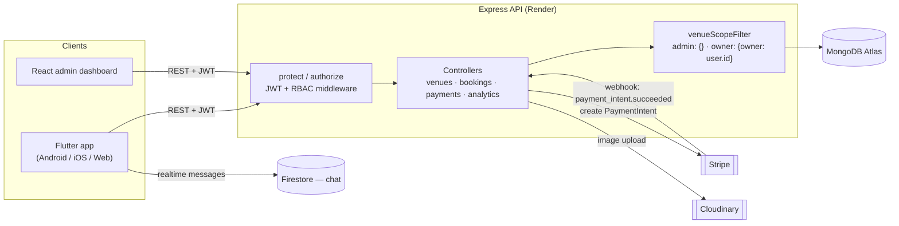
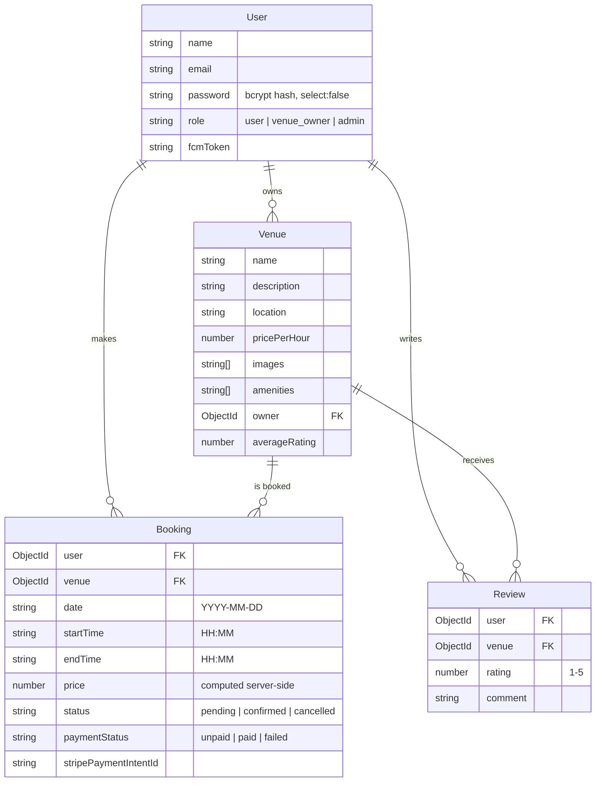
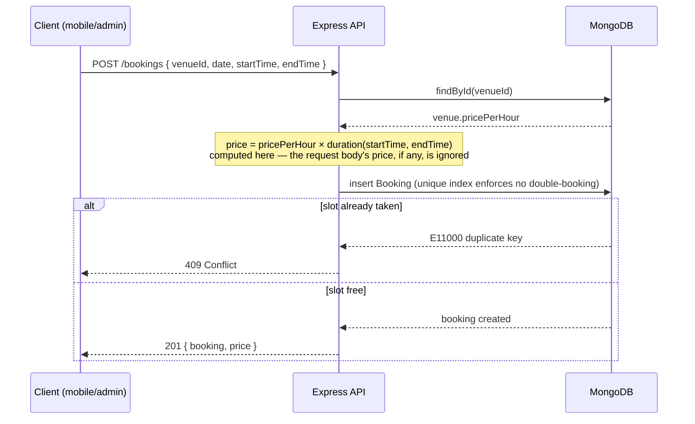
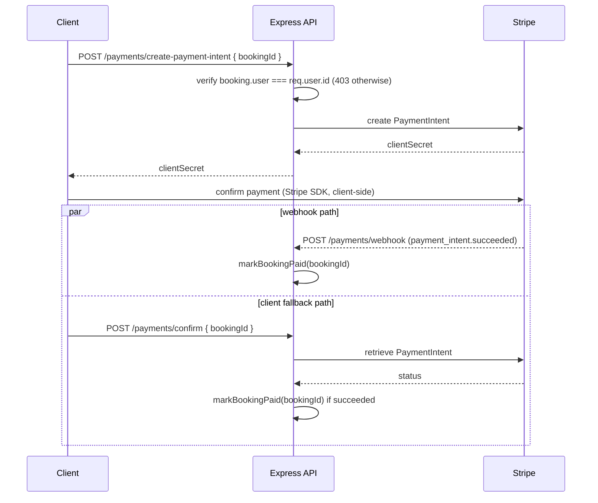

# Architecture

## System overview



Chat is the one feature that bypasses the Express API entirely — the mobile
app talks to Firestore directly for message send/receive, since that's what
Firestore's realtime listeners are for. Everything else (auth, venues,
bookings, payments, analytics) goes through the API so it can be
authorized, validated, and priced server-side.

## Data model



Notes on choices that aren't obvious from the field list:

- **`Booking.price` is never accepted from the client.** The controller
  looks up `venue.pricePerHour` and computes `price` itself from the
  requested time range — see [Booking flow](#booking-flow) below.
- **`Booking` has a partial unique index** on `{ venue, date, startTime }`,
  scoped via `partialFilterExpression` to `status: { $in: ['pending',
  'confirmed'] }`. A `cancelled` booking doesn't hold the index entry, so
  the slot becomes bookable again — but two *active* bookings for the same
  venue/date/time collide at the database layer, not just in application
  code that a second code path could route around.
- **`Venue.averageRating` is a denormalized field**, recalculated by a
  post-save hook on `Review` (`Review.getAverageRating()`). It's a
  deliberate read-optimization: venue lists render a rating on every card,
  and recomputing an aggregate over all reviews on every venue-list request
  would be wasteful.

## Booking flow (server-side pricing)

This is the flow the [README's engineering highlights](../README.md#engineering-highlights)
call out — the client never gets to say what a booking costs.



## Payment flow (dual confirmation path)

Booking confirmation doesn't rely on a single signal. The client-driven
`/payments/confirm` call and the Stripe webhook both funnel into the same
idempotent `markBookingPaid()`, because either one can be the first to
observe a succeeded PaymentIntent — the webhook can be delayed, and the
client can't be trusted to just assert success (see
[routes/payments.js](../backend/routes/payments.js)).



`markBookingPaid()` no-ops if the booking is already marked `paid`, so
whichever path arrives second is a safe, cheap redundant call rather than a
double-notification bug.

## Role-based data scoping

Admin and venue-owner dashboards are the same UI reading from the same
endpoints (`/analytics`, `/bookings/owner`, `/venues/mine`) — the only
difference is a single filter object built by `venueScopeFilter`
(`backend/utils/scopeVenues.js`):

```js
// admin  -> {}                    (no filter — platform-wide)
// owner  -> { owner: user.id }    (scoped to their own venues)
```

That filter is threaded into the analytics aggregation's `$match` stage (or
omitted entirely for admin, rather than building a large `$in` array of
every venue ID on the platform) and into the venue/booking list queries.
This is why the admin dashboard shows real platform-wide numbers instead of
an empty state: before this existed, every non-owner (including admin, who
owns no venues) hit a query scoped to `owner: req.user.id` and got back
nothing.

## Frontend structure

**Mobile app** (`mobile-app/lib/`) is grouped by feature, with cross-cutting
concerns under `core/`:

```
features/{auth,venues,bookings,chat,payments,profile}/
core/{config,network,router,services,utils,widgets}/
```

`core/network/api_client.dart` wraps `dio` with one auth interceptor and one
error interceptor that maps every failure — network, HTTP, parse — into a
single typed `ApiException`, so UI code handles one error shape regardless
of what went wrong underneath. `core/router/` holds a single
`authRedirect(AuthStatus, location)` pure function that decides where an
unauthenticated or authenticated user should land; it's `@visibleForTesting`
specifically so the redirect matrix can be unit-tested without booting the
full app.

**Web admin** (`web-admin/src/`) is a standard Vite/React layout
(`pages/`, `components/`, `context/`, `api/`). `Dashboard.jsx` computes
`isAdmin = user.role === 'admin'` once and threads it as a prop into the
child components (`AnalyticsDashboard`, `VenueList`, `BookingList`), which
each render an admin-only affordance (owner column, platform-wide labels)
off that one prop rather than re-deriving role state independently.
